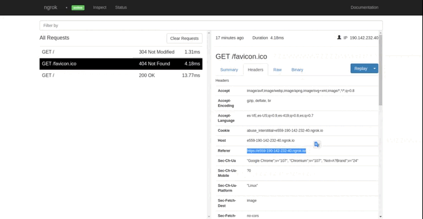
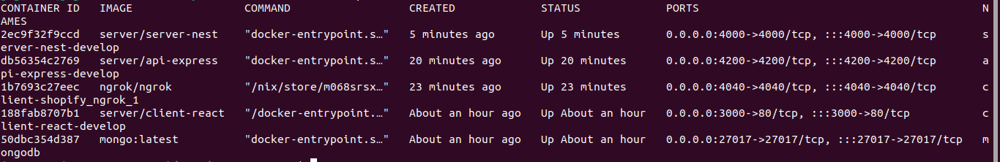
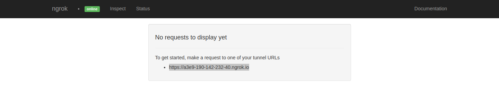

# Docker-Nest-Graphql-Mongo-JWT-Express-React-Redux Toolkit

## Features

#### Demo Api-Rest


#### Demo Server Run


#### Docker container


## Characteristic
* User login
* Routes protected with React Router
* JWT storage in NestJs and Express
* `createAsyncThunk` from the Redux Toolkit
* Automatically get products from the shopify store when you log in
* Express works as a microservice that fetches products from shopify
* Store products in monodb
* All environments are built with docker and docker-compose

## Starting 🚀

*  These instructions will allow you to obtain a copy of the running project on your local machine for development and testing purposes.

## Usage
### Starter files
Clone the `starter-files` branch with the following command:

```bash
git clone https://github.com/alejandroagraz/client-shopify.git
```

#### Directory Structure
```diff

+ ┌── workspace
+ | ├── docker-files
+ | │ └── mongo
+ | |   └── Dockerfile
+ | │   └── init.json
+ | ├── projects
+ | | └── backend-nest
+ | | └── frontend-react
+ | | └── client-shopify-express
+ | ├── docker-compose.debug
+ | ├── docker-compose.yml
+ | ├── README.md
+ └─└── .env

```

## Prerequisites 📋

#### Docker Engine

##### Docker Installation On Linux
* [Docker For Linux](https://docs.docker.com/install/linux/docker-ce/ubuntu/)

##### Docker Installation On Windows
* [Docker For Windows](https://docs.docker.com/docker-for-windows/install/)

#### Docker Compose

##### Docker Compose Installation
* [Docker Compose](https://docs.docker.com/compose/install/)

#### Enabling Non-root Users to Run Docker Commands (Optional)
```diff
sudo groupadd docker
sudo gpasswd -a $USER docker
newgrp docker

+ In the case of a virtual machine, it may be necessary to restart the virtual machine for the changes to take effect.

```

## Initialize (In the main directory run this /workspace)

```diff

+ Rename the file found in the root directory ./ example-env to .env

+ Go to directory the projects/backend-nest directory and rename the file example-env to .env

+ Go to the directory projects/client-shopify-express directory and rename the file example-env to .env

+ create network shopify
    docker network create shopify
    
+ Go to directory the /workspace and run the following commands from terminal
    docker-compose up --build -d
```

#### Configure files .env 📖

#### Example view http://localhost:4040/inspect



```diff
+ Go to browser to url http://localhost:4040/inspect/http and copy tunnel URLs

+ Go to the project/client-shopify-express directory and add the tunnel URLs in your .env in the API_EXT and HOST environment variables
    Format Example tunnel URLs (https://e559-190-142-232-40.ngrok.io/) 
    API_EXT=https://e559-190-142-232-40.ngrok.io/
    HOST=e559-190-142-232-40.ngrok.io (In this environment variable add without the protocols)
    
+ Go to the project/backend-nest directory and add the tunnel URLs in your .env in the API_EXT environment variable
    Format Example tunnel URLs (https://e559-190-142-232-40.ngrok.io/) 
    API_EXT=https://e559-190-142-232-40.ngrok.io/
    
+ From the terminal run the following commands
    docker-compose up --build -d api-client app-server
```

```diff
+ When completing the previous steps we are ready to go to the browser to start using our application go to browser to url http://localhost:3000/login
    User: admin
    Password: 102911
```

## Additional information 📖

#### Crear host
```diff
+ Edit the hosts file of your operating system, adding the ip address of the nginx container and the hostnames example:
    localhot:3000 local.test.it

+ In the case of Linux operating system the hosts file is located in the etc directory (/etc/hosts).
```

#### Docker Images
```diff
+ View images
    docker images

+ Remove an image
    docker rmi (imageId o el imageName)

+ Remove all images
    docker rmi $(docker ps -a -q)
```

#### SOLID
```diff
+ In this project the 5 SOLID principles were applied:
    S – Single Responsibility Principle (SRP)
    O – Open/Closed Principle (OCP)
    L – Liskov Substitution Principle (LSP)
    I – Interface Segregation Principle (ISP)
    D – Dependency Inversion Principle (DIP)
    
+ Justification:
    All the projects are modulated and the code is reusable, unique responsibilities were delegated to each project, 
    it should be noted that a pagination was missing to list the products but because a demonstration is being carried out, 
    the decision was made to reject the pagination for reasons of times.
```

#### Docker Containers
```diff
+ View containers running
    docker ps

+ View containers stopped and running
    docker docker ps -a

+ Enter a container
    docker exec -ti (containerName o el ContainerId) /bin/sh

+ Stop a container
    docker stop (containerName o el ContainerId)

+ Remove a container
    docker rm (containerName o el ContainerId)

+ Start all containers
    docker start $(docker ps -a -q)

+ Stop all containers
    docker stop $(docker ps -a -q)

+ Turn off all containers
    docker-compose down

+ Remove all containers
    docker rm $(docker ps -a -q)
```
## Built With 🛠️
```diff
+    ReactJs
+    Redux Toolkit
+    NestJs
+    Express
+    MongoDB
+    Shopify
+    Docker
+    Docker Compose
```

## Developed Container ✒️
```diff
+    Developed by: Jose Agraz 
+    Email: joseagraz29@gmail.com
```
